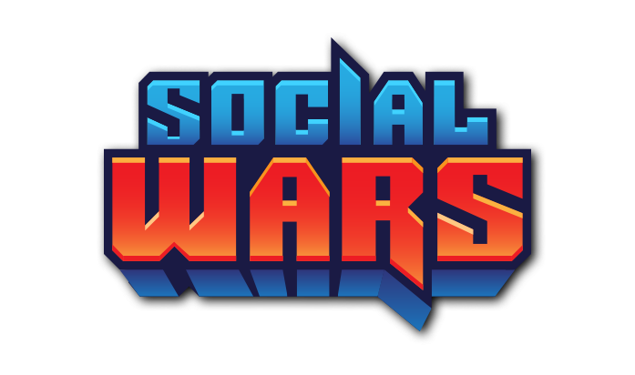

The Social Wars preservation project by the Social Warriors team.
This project is dedicated to preserving this Flash game so that it's not lost to time.

[](../../releases/latest)
[](https://discord.gg/zW5gSbQJBw)

## On archives and accessibility to digital heritage

- [Exemption to PCCPSACT](https://www.federalregister.gov/documents/2018/10/26/2018-23241/exemption-to-prohibition-on-circumvention-of-copyright-protection-systems-for-access-control), exemptions to the provision of the Digital Millennium Copyright Act (“DMCA”). 
- [EFGAMP](https://efgamp.eu/), the European Federation of Video Game Archives, Museums and Preservation projects.
- [UNESCO PERSIST Programme](https://unescopersist.org/), helps ensure that digital information can continue to be accessed in the future.
- [The Internet Archive](https://archive.org/), a digital library of Internet sites and other cultural artifacts in digital form.
- [BlueMaxima's Flashpoint](https://bluemaxima.org/flashpoint/), the webgame preservation project.
- [Adobe Flash Player Archive](https://archive.org/download/flashplayerarchive/), the Adobe Inc. archive.org Flash Player Archive.

---

## License [](http://www.gnu.org/licenses/gpl-3.0)

```
Social Wars preservation project.
Copyright (C) 2022  The Social Warriors team
See the GNU General Public License <https://www.gnu.org/licenses/>.
```
